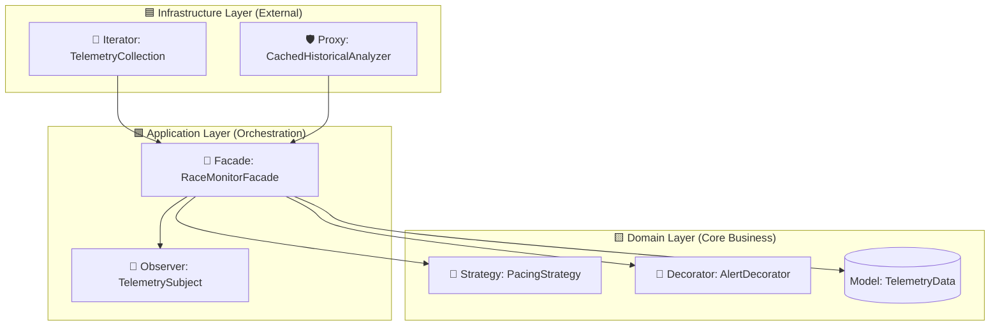

# 🏃‍♂️ UltraTrack: Real-Time Telemetry & Analytics Backend


> A robust, decoupled backend system designed for the real-time monitoring, management, and analysis of runners in ultra-distance endurance events (e.g., 50km, 82km, and 100-mile races).

---

## 🎯 Project Overview

**UltraTrack** is built to process massive volumes of telemetry data originating from athletes' GPS watches and heart rate monitors. 

### 🚀 Core Objectives
* **Real-Time Processing:** Parse streams of telemetry data accurately.
* **Predictive Analytics:** Calculate Estimated Time of Arrival (ETA) and predict physical depletion (e.g., hydration, sodium loss) based on current pacing and terrain.
* **Health Anomaly Detection:** Dynamically generate and route medical or pacing alerts.
* **Decoupled Distribution:** Distribute processed insights to various consumer interfaces (organizer dashboards, SMS gateways, logging systems) without blocking the main processing thread.

---

## 🏛️ Architectural Design

The project strictly adheres to **Clean Architecture** principles, decoupling the core business logic from infrastructure details and delivery mechanisms. 



---

## 🧩 GoF Design Patterns Composition

To maintain low coupling, high cohesion, and scalable code, UltraTrack employs a composition of six Gang of Four (GoF) design patterns.

| Pattern | Type | Location | Role |
| :--- | :--- | :--- | :--- |
| 🚪 **Facade** | Structural | `application.facade` | Provides a single, unified entry point (`processNewTelemetry()`) to hide complex subsystem orchestration from external clients. |
| 🔄 **Iterator** | Behavioral | `infrastructure.iterator` | Standardizes the traversal of complex incoming telemetry data streams (JSON, queues) without exposing internal representations. |
| 🛡️ **Proxy** | Structural | `infrastructure.proxy` | Intercepts resource-intensive historical data queries, utilizing caching and lazy initialization to protect server memory. |
| 🧠 **Strategy** | Behavioral | `domain.strategy` | Injects distinct mathematical strategies (e.g., `FlatTerrainStrategy`, `MountainTrailStrategy`) at runtime based on geolocation, avoiding massive conditional blocks. |
| 🎁 **Decorator** | Structural | `domain.decorator` | Dynamically wraps basic health alerts with additional behaviors (e.g., `HighPriority`, `Encrypted`) at runtime to prevent subclass explosion. |
| 📡 **Observer** | Behavioral | `application.observer` | Uses a Pub/Sub model to notify decoupled endpoints (dashboards, SMS) whenever the core engine processes new telemetry. |

---

## 📂 Directory Structure

```text
src/main/java/com/ultratrack/
├── domain/                     
│   ├── model/                  
│   ├── strategy/               
│   └── decorator/              
├── application/                
│   ├── facade/                 
│   └── observer/               
└── infrastructure/             
    ├── proxy/                  
    └── iterator/               
```

---

## 🛠️ Local Development & Setup

The project is optimized for automated infrastructure and runs smoothly in Unix-based environments.

1. **Clone the repository** via Git.
2. **Environment Setup:** For the most native and frictionless build experience, especially when dealing with containerization later on, we highly recommend using **WSL2 (Ubuntu)** if you are developing on a Windows machine.
3. **Access Control:** Ensure your local SSH keys are configured for secure repository interactions.
4. **Build:** Run the standard Java build sequence to resolve dependencies.

---

## 📅 Next Steps for Development
- [ ] Define the internal fields of the `domain.model.TelemetryData` entity.
- [ ] Implement the concrete classes for the Strategy pattern to handle math/physics calculations.
- [ ] Wire the Observers to mock terminal outputs for local testing.